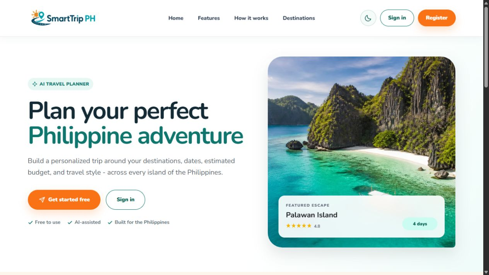

# SmartTrip Planner PH

SmartTrip Planner PH helps travelers organize Philippine destinations, trip dates, itineraries and estimated budgets. Its React interface follows the proposal design system, with teal branding, orange actions, Nunito typography, rounded cards and light/dark themes.

## Current milestone

Week 1 design and connected foundation, due September 23, 2026. This is not a finished production release.

- Public landing, sign-in, registration and recovery interfaces.
- Dashboard, trips, trip creation/editing, destinations, analytics, profile and settings interfaces.
- Responsive desktop/mobile navigation and light/dark themes.
- Twenty curated destinations, with selected locally stored landmark photos and unavailable-photo fallbacks.
- Supabase authentication integration and API profile creation.
- Fixed Philippines map preview only. Interactive trip maps/directions are disabled through `client/src/lib/releaseScope.js`.
- Atlas is not exposed in the interface. AI configuration and verification remain pending.

Implemented screens and API handlers are not equivalent to fully verified user flows.

## Stack

React and Vite; Node.js and Express; Prisma and PostgreSQL; Supabase authentication; Leaflet/OpenStreetMap for the map preview. AI integration code is retained but live provider functionality is not claimed complete.

## Application routes

### Public and account pages

| Route | Page | Access / notes |
| --- | --- | --- |
| `/` | Landing | Public |
| `/login` | Sign in | Supabase account required |
| `/register` | Registration | Email confirmation follows project configuration |
| `/forgot-password` | Password recovery | Requests a recovery email |
| `/reset-password` | New password | Valid recovery session required |
| `/share/:token` | Shared trip | Valid share token required; sharing/privacy verification pending |

### Protected pages

All `/app` routes require a signed-in session; unauthenticated visitors are redirected to sign in.

| Route | Page | Current scope |
| --- | --- | --- |
| `/app` | Dashboard | Trip summaries, quick actions and empty states |
| `/app/trips` | My Trips | Listing, search and filtering interface |
| `/app/create` | Create Trip | Destination, dates, travelers, starting point and budget |
| `/app/trips/:id` | Trip details | Itinerary, activities, budget and trip actions |
| `/app/trips/:id/edit` | Edit Trip | Existing-trip editing form |
| `/app/destinations` | Destinations | Discovery cards, search and interest filters |
| `/app/map` | Travel Map | Fixed geographic preview; no interactive trip mapping |
| `/app/analytics` | Analytics | Trip and estimated-budget summaries |
| `/app/profile` | Profile | Profile photo, personal details and starting point |
| `/app/settings` | Settings | Appearance, reminders and account-deletion interface |

Replace `:id` with an accessible trip ID and `:token` with a valid share token. Unknown public/application paths render the error page. Atlas has no standalone page route.

## Setup and installation

Requirements: Node.js 20.19+ (or a compatible newer supported release), npm, and a Supabase project with PostgreSQL access.

```bash
git clone https://github.com/JvlKe/smarttrip-planner-ph-.git
cd smarttrip-planner-ph-
npm ci
```

Copy `client/.env.example` to `client/.env`, and `server/.env.example` to `server/.env`. On Windows PowerShell:

```powershell
Copy-Item client/.env.example client/.env
Copy-Item server/.env.example server/.env
```

Do not overwrite already configured files. Replace example values locally; never commit real credentials.

### Client configuration

| Variable | Example / purpose |
| --- | --- |
| `VITE_SUPABASE_URL` | `https://your-project.supabase.co` |
| `VITE_SUPABASE_PUBLISHABLE_KEY` | Your project's public publishable key |
| `VITE_API_URL` | `http://localhost:4000/api` |

Only public configuration belongs in Vite variables. Never place database passwords, Supabase secret/service keys or AI keys in the client.

### Server configuration

| Variable | Example / purpose |
| --- | --- |
| `PORT` | `4000` |
| `CLIENT_URL` | `http://localhost:5173`; allowed browser origin |
| `SUPABASE_URL` | Same project URL as the client |
| `SUPABASE_PUBLISHABLE_KEY` | Same public key as the client |
| `DATABASE_URL` | PostgreSQL application connection; use the provider's connection string |
| `DIRECT_URL` | Migration-compatible database connection |
| `GEMINI_API_KEY` | Server-only key; optional until AI is configured |
| `GEMINI_MODEL` | Model setting from the example file; provider availability must be verified |
| `GROQ_API_KEY` | Server-only key; optional until AI is configured |
| `GROQ_ATLAS_MODEL` | Atlas model setting; interface currently hidden |
| `GROQ_ITINERARY_MODEL` | Itinerary model setting |

Use the placeholder connection-string formats in [server/.env.example](server/.env.example), replacing project, host and password values with those provided for your database. URL-encode reserved characters in database passwords.

Configure Supabase Auth to allow `http://localhost:5173/login` for confirmation and `http://localhost:5173/reset-password` for recovery. Keep the browser origin consistent; localhost and 127.0.0.1 have separate browser sessions.

### Database and local development

```bash
npm run check:connection
npm run db:generate
npm run db:deploy
npm run db:seed
npm run dev
```

Confirm the intended database before running migrations or seeding: those commands modify it. The seed creates/updates the 20 curated destinations.

Open [the local website](http://localhost:5173). The API runs on port 4000; [its health endpoint](http://localhost:4000/api/health) returns a service status. Health alone does not verify database connectivity.

To start only one service, use `npm run dev -w client` or `npm run dev -w server`. Frontend-only rendering does not provide working authenticated data flows. The client uses a strict port: stop a duplicate server if port 5173 is occupied. Restart after environment changes.

## Typical usage

1. Open the landing page and register or sign in.
2. Confirm your email if required by the configured Supabase project.
3. Review your profile and starting point.
4. Browse destinations, create a trip, then access it through My Trips.
5. Review itinerary and budget information; use the edit screen for trip changes.
6. Change appearance or account preferences in Settings.

This describes intended navigation. Complete authentication, data-write, AI, sharing and export flows still require end-to-end verification.

## Main API endpoints

These are implemented endpoints, not a claim that every live workflow has been tested. Protected endpoints require a Supabase bearer token and enforce their route-level authorization.

| Method | Path | Purpose |
| --- | --- | --- |
| GET | `/api/health` | Service health |
| GET | `/api/destinations` | Featured destinations |
| GET | `/api/destinations/photo?title=...` | External photo lookup |
| GET / PUT / DELETE | `/api/profile` | Read/update profile or confirmed account deletion |
| GET / POST | `/api/trips` | List/create trips |
| GET | `/api/trips/stats` | Trip statistics |
| GET / PUT / DELETE | `/api/trips/:id` | Read/update/delete an owned trip |
| POST | `/api/trips/:id/status` | Change trip status |
| PATCH | `/api/trips/:id/budget` | Update budget |
| POST | `/api/itinerary/trips/:tripId/days` | Add itinerary day |
| POST | `/api/itinerary/days/:dayId/activities` | Add activity |
| PUT / DELETE | `/api/itinerary/activities/:id` | Edit/delete activity |
| GET | `/api/travel/:id` | Trip travel toolkit |
| GET | `/api/share/:token` | Read shared trip |
| POST / DELETE | `/api/share/trips/:id` | Create/revoke sharing |

Additional handlers live in `server/src/routes/`, including day management, activity ordering, checklists and AI integrations. Auth registration, login and recovery use Supabase rather than custom Express login endpoints.

## Project structure

- `client/src/App.jsx`: application routing, protected shell and navigation.
- `client/src/pages/`: public, account and protected screens.
- `client/src/components/`: shared controls, images and map preview.
- `client/src/context/`: authentication state.
- `client/src/lib/`: client API helpers, Supabase and release settings.
- `client/src/style.css`, `tactile.css`, `fresh.css`, `proposal.css`: shared/page styles.
- `client/public/assets/`: logos and local destination photography.
- `server/src/`: Express API, middleware and integrations.
- `server/prisma/`: database schema, migrations and seed.
- `server/scripts/`: connectivity checks.
- `server/test/`: automated tests.
- `AI-USAGE.md`: AI assistance and authorship evidence.

## Verification

```bash
npm run build -w client
npm test
npm run build
```

The full build also runs Prisma schema validation and requires server database environment variables. It does not deploy the application or prove live workflows.

Recorded results:
- Client production build and all 16 server tests passed in the submission copy.
- Earlier configured-environment checks confirmed Supabase Auth/PostgreSQL connectivity, 20 destinations and 11 applied migrations.
- Main application layouts were checked at 320/768/1024/1440 pixels in light/dark modes without document-width overflow. This is not certification across every browser or physical device.

## Screenshots

This privacy-safe screenshot was captured from the running Week 1 application. It is application evidence, not a proposal mockup.



## Known limitations and next steps

- Full registration, confirmation, recovery and session-flow verification remains pending.
- Populated-trip creation/editing/persistence, budgets, analytics, sharing and exports require end-to-end tests.
- Map tiles need network access; interactive trip maps/directions are deferred.
- Atlas is hidden; AI credentials/provider behavior are not verified.
- External destination-photo lookup can fail; fallbacks are provided.
- The latest clean-install audit reported two moderate and four high vulnerabilities; compatible remediation is pending.
- No current public deployment has been verified. Separate client/API Vercel deployment and live testing remain planned.
- Additional screenshots of authenticated workflows will be added after their end-to-end verification.

## AI credit

Developed with substantial AI assistance for code, design, troubleshooting, tests and documentation. See [AI-USAGE.md](AI-USAGE.md) for the working evidence log, corrections and authorship status. Independently authored backend contributions are not yet verified.

Weekly reports, documentation submissions and personal reflections belong in the private class workspace; this public repository contains the application and required public documentation.

## Photo credits

- Samal: Wikityrey, [Pearl Farm at Samal Island, Davao](https://commons.wikimedia.org/wiki/File:Pearl_Farm_at_Samal_Island,_Davao.jpg), [CC BY-SA 4.0](https://creativecommons.org/licenses/by-sa/4.0/).
- Baguio: Patrickroque01, [Burnham Park Lake](https://commons.wikimedia.org/wiki/File:Burnham_Park_Lake_(Baguio_City;_12-04-2022).jpg), [CC BY-SA 4.0](https://creativecommons.org/licenses/by-sa/4.0/).
- Cebu: Joshua Lim (Sky Harbor), [Magellan's Cross](https://commons.wikimedia.org/wiki/File:Magellan%27s_Cross_full.jpg), [CC BY-SA 3.0](https://creativecommons.org/licenses/by-sa/3.0/).
- These three photographs are displayed with responsive CSS cropping; Baguio and Cebu use Wikimedia thumbnails. Original photographs remain under their respective licenses.

- Boracay: Choi2451, [White beach on Boracay island](https://commons.wikimedia.org/wiki/File:White_beach_on_boracay_island.jpg)
- Batanes: Johnkevinreglos, [Vayang Rolling Hills, Batanes, Philippines](https://commons.wikimedia.org/wiki/File:Vayang_Rolling_Hills,_Batanes,_Philippines.jpg)
- Siargao: CharMel Creations, [Siargao Island](https://commons.wikimedia.org/wiki/File:Siargao_Island.jpg)
