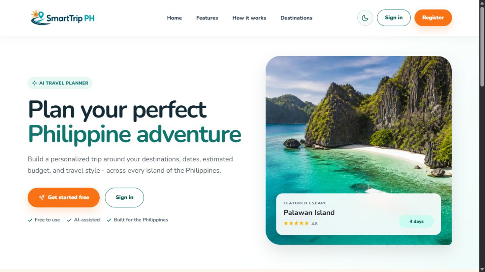

# SmartTrip Planner PH

[](AI-USAGE.md)

SmartTrip Planner PH helps travelers organize Philippine destinations, trip dates, itineraries and estimated budgets. Its React interface follows the proposal design system, with teal branding, orange actions, Nunito typography, rounded cards and light/dark themes.

## Current milestone

Week 3 hardening is deployed on Vercel for demonstration. Trip creation and AI itinerary generation/regeneration have been exercised in the deployed browser, but this is not a fully verified production release. Week 2 work was recorded September 24–26, 2026.

- Public landing, sign-in, registration and recovery interfaces.
- Dashboard, trips, trip creation/editing, destinations, analytics, profile and settings interfaces.
- My Trips supports server-side text search, status filters, sorting and pagination.
- Responsive desktop/mobile navigation and light/dark themes.
- Twenty curated destinations, with selected locally stored landmark photos and unavailable-photo fallbacks.
- Cubao, Quezon City is the default trip starting point; travelers can replace it with a local or international location in Profile.
- Supabase authentication integration and API profile creation.
- Interactive trip maps support itinerary pins, day filters, map/list views, GeoJSON export and Google Maps directions when coordinates are available.
- Atlas is not exposed in the interface. Deployed-browser checks confirmed AI itinerary generation and regeneration; other assistant/provider behavior is not claimed as verified.

Implemented screens and API handlers are not equivalent to fully verified user flows.

## Stack

React and Vite; Node.js and Express; Prisma and PostgreSQL; Supabase authentication; Leaflet/OpenStreetMap for the map preview. AI-assisted itinerary generation and regeneration are available; other assistant/provider behavior remains unverified.

## Application routes

### Public and account pages

| Route | Page | Access / notes |
| --- | --- | --- |
| `/` | Landing | Public |
| `/login` | Sign in | Supabase account required |
| `/register` | Registration | Email confirmation follows project configuration |
| `/forgot-password` | Password recovery | Requests a recovery email |
| `/reset-password` | New password | Valid recovery session required |
| `/share/:token` | Shared trip | Valid share token required; sharing/privacy verification pending |

### Protected pages

All `/app` routes require a signed-in session; unauthenticated visitors are redirected to sign in.

| Route | Page | Current scope |
| --- | --- | --- |
| `/app` | Dashboard | Trip summaries, quick actions and empty states |
| `/app/trips` | My Trips | Listing, search and filtering interface |
| `/app/create` | Create Trip | Destination, dates, travelers, starting point and budget |
| `/app/trips/:id` | Trip details | Itinerary, activities, budget, add/remove day controls and trip actions |
| `/app/trips/:id/edit` | Edit Trip | Existing-trip editing form |
| `/app/destinations` | Destinations | Discovery cards, search and interest filters |
| `/app/map` | Travel Map | Trip pins, day filtering, map/list views, GeoJSON pin export and Google Maps directions; availability depends on coordinates and network access |
| `/app/analytics` | Analytics | Trip and estimated-budget summaries |
| `/app/profile` | Profile | Profile photo, personal details and starting point |
| `/app/settings` | Settings | Appearance, reminders and account-deletion interface |

Replace `:id` with an accessible trip ID and `:token` with a valid share token. Unknown public/application paths render the error page. Atlas has no standalone page route.

## Setup and installation

Requirements: Node.js 20.19+ (or a compatible newer supported release), npm, and a Supabase project with PostgreSQL access.

```bash
git clone https://github.com/JvlKe/smarttrip-planner-ph-.git
cd smarttrip-planner-ph-
npm ci
```

Copy `client/.env.example` to `client/.env`, and `server/.env.example` to `server/.env`. On Windows PowerShell:

```powershell
Copy-Item client/.env.example client/.env
Copy-Item server/.env.example server/.env
```

Do not overwrite already configured files. Replace example values locally; never commit real credentials.

### Client configuration

| Variable | Example / purpose |
| --- | --- |
| `VITE_SUPABASE_URL` | `https://your-project.supabase.co` |
| `VITE_SUPABASE_PUBLISHABLE_KEY` | Your project's public publishable key |
| `VITE_API_URL` | `http://localhost:4000/api` |

Only public configuration belongs in Vite variables. Never place database passwords, Supabase secret/service keys or AI keys in the client.

### Server configuration

| Variable | Example / purpose |
| --- | --- |
| `PORT` | `4000` |
| `CLIENT_URL` | `http://localhost:5173`; allowed browser origin |
| `SUPABASE_URL` | Same project URL as the client |
| `SUPABASE_PUBLISHABLE_KEY` | Same public key as the client |
| `DATABASE_URL` | PostgreSQL application connection; use the provider's connection string |
| `DIRECT_URL` | Migration-compatible database connection |
| `GEMINI_API_KEY` | Server-only key; optional until AI is configured |
| `GEMINI_MODEL` | Model setting from the example file; provider availability must be verified |
| `GROQ_API_KEY` | Server-only key; optional until AI is configured |
| `GROQ_ATLAS_MODEL` | Atlas model setting; interface currently hidden |
| `GROQ_ITINERARY_MODEL` | Itinerary model setting |

Use the placeholder connection-string formats in [server/.env.example](server/.env.example), replacing project, host and password values with those provided for your database. URL-encode reserved characters in database passwords.

Configure Supabase Auth to allow `http://localhost:5173/login` for confirmation and `http://localhost:5173/reset-password` for recovery. Keep the browser origin consistent; localhost and 127.0.0.1 have separate browser sessions.

### Database and local development

```bash
npm run check:connection
npm run db:generate
npm run db:deploy
npm run db:seed
npm run dev
```

Confirm the intended database before running migrations or seeding: those commands modify it. The seed creates/updates the 20 curated destinations.

Open [the local website](http://localhost:5173). The API runs on port 4000; [its health endpoint](http://localhost:4000/api/health) returns a service status. Health alone does not verify database connectivity.

To start only one service, use `npm run dev -w client` or `npm run dev -w server`. Frontend-only rendering does not provide working authenticated data flows. The client uses a strict port: stop a duplicate server if port 5173 is occupied. Restart after environment changes.

## Typical usage

1. Open the landing page and register or sign in.
2. Confirm your email if required by the configured Supabase project.
3. Review your profile and starting point.
4. Browse destinations, create a trip, then access it through My Trips.
5. Review itinerary and budget information; use the edit screen for trip changes.
6. Change appearance or account preferences in Settings.

This describes intended navigation. Complete authentication, data-write, AI, sharing and export flows still require end-to-end verification.

## Main API endpoints

These are implemented endpoints, not a claim that every live workflow has been tested. Protected endpoints require a Supabase bearer token and enforce their route-level authorization.

| Method | Path | Purpose |
| --- | --- | --- |
| GET | `/api/health` | Service health |
| POST | `/api/client-errors` | Rate-limited frontend error reporting |
| GET | `/api/destinations` | Featured destinations |
| GET | `/api/destinations/search` | Search destinations with optional text, region, interest, month, budget, trip-length, and pagination filters |
| GET | `/api/destinations/photo?title=...` | External photo lookup |
| GET / PUT / DELETE | `/api/profile` | Read/update profile or confirmed account deletion |
| GET / POST / DELETE | `/api/favorites` | List, save, or remove the signed-in user's favorite destinations |
| GET / POST | `/api/trips` | List/create trips; listing supports `q`, `status`, `sort`, `page` and `pageSize` filters and returns pagination metadata |
| GET | `/api/trips/stats` | Trip statistics |
| GET | `/api/trips/analytics` | Monthly planned trip and budget totals for the signed-in user |
| GET / PUT / DELETE | `/api/trips/:id` | Read/update/delete an owned trip |
| POST | `/api/trips/:id/status` | Change trip status |
| POST | `/api/trips/:id/duplicate` | Duplicate an owned trip |
| PATCH | `/api/trips/:id/budget` | Update budget |
| PATCH | `/api/trips/:id/base` | Update trip accommodation/base details |
| PATCH | `/api/trips/:id/cover` | Update the trip cover |
| POST | `/api/itinerary/trips/:tripId/days` | Add itinerary day |
| PUT / DELETE | `/api/itinerary/days/:dayId` | Update/delete an itinerary day |
| POST | `/api/itinerary/days/:dayId/activities` | Add activity |
| PUT / DELETE | `/api/itinerary/activities/:id` | Edit/delete activity |
| POST | `/api/itinerary/activities/:id/duplicate` | Duplicate an activity within the trip |
| POST | `/api/itinerary/activities/:id/move` | Move an activity to another day in the same trip |
| PATCH | `/api/itinerary/activities/:id/reorder` | Reorder an activity within its day |
| PATCH | `/api/itinerary/activities/:id/state` | Mark an activity planned, visited, or skipped |
| POST | `/api/itinerary/alternatives/:id/add` | Add a suggested alternative to the itinerary |
| POST | `/api/itinerary/trips/:tripId/refresh-locations` | Refresh itinerary location coordinates |
| POST | `/api/itinerary/trips/:tripId/generate` | Generate an itinerary for a trip |
| POST | `/api/itinerary/trips/:tripId/improve` | Improve one itinerary day |
| GET | `/api/travel/:id` | Trip travel toolkit |
| POST | `/api/travel/:id/checklist` | Add a checklist item |
| PATCH / DELETE | `/api/travel/checklist/:itemId` | Update or delete a checklist item |
| PUT | `/api/travel/:id/checklist/reorder` | Reorder an owned trip's checklist items |
| GET | `/api/travel/:id/packing-suggestions` | Get trip-specific packing suggestions not already on the checklist |
| GET | `/api/share/:token` | Read shared trip |
| POST / DELETE | `/api/share/trips/:id` | Create/revoke sharing |
| POST | `/api/assistant/chat` | Ask the travel assistant |

Auth registration, login and recovery use Supabase rather than custom Express login endpoints. Unknown API paths return a JSON 404 response.

## Project structure

- `client/src/App.jsx`: application routing, protected shell and navigation.
- `client/src/pages/`: public, account and protected screens.
- `client/src/components/`: shared controls, images and map preview.
- `client/src/context/`: authentication state.
- `client/src/lib/`: client API helpers, Supabase and release settings.
- `client/src/style.css`, `tactile.css`, `fresh.css`, `proposal.css`: shared/page styles.
- `client/public/assets/`: logos and local destination photography.
- `server/src/`: Express API, middleware and integrations.
- `server/prisma/`: database schema, migrations and seed.
- `server/scripts/`: connectivity checks.
- `server/test/`: automated tests.
- `AI-USAGE.md`: AI assistance and authorship evidence.

## Verification

Latest local checks (October 4, 2026): `npm run build` passed (Vite production build and Prisma schema validation). The default `npm test -w server` runner hits `spawn EPERM` in this environment, but this workaround passed **93 tests with 1 opt-in database test skipped**: `npm test -w server -- --test-isolation=none --test-concurrency=1`. HTTP tests use mocked database/auth services and do not prove live Supabase behavior. The October 4 itinerary-day changes still need a targeted live check.

The October 4, 2026 `npm audit` check reported zero vulnerabilities. Re-run the audit before the final release/submission because dependency advisories can change.

```bash
npm run build -w client
npm test
npm run build
```

If Node's test runner cannot spawn workers in a restricted Windows environment, run the server tests without test-file isolation:

```bash
npm test -w server -- --test-isolation=none --test-concurrency=1
```

The full build also runs Prisma schema validation. It does not deploy the application or prove live workflows.

Recorded results (September 26, 2026):
- The recorded pre-integration `npm test` run passed all 40 server tests. The opt-in database test is skipped during the default run.
- `npm run build`: the Vite client production build and Prisma schema validation passed.
- `npm run check:connection`: Supabase Auth was reachable, PostgreSQL connected, and 20 destination records were present.
- Eight protected pages were checked at 320, 768, 1024, and 1440 pixels; Trip Detail was also checked at those widths. No document-width overflow or broken images appeared in those checks. This is not certification across every browser or physical device.
- The dashboard's Recent Trips image now fills its card at desktop width and retains its compact phone layout.
- The user-reported database-backed trip-flow test at `server/test/trip-flow.test.js` passed 8 tests. It uses Prisma directly rather than HTTP routes, authentication, or the browser. It skips by default. From `server/`, opt in only with a development/test database:

  ```powershell
  $env:RUN_DATABASE_FLOW_TEST = "1"
  node --test test/trip-flow.test.js
  Remove-Item Env:RUN_DATABASE_FLOW_TEST
  ```

  The Bash equivalent is `RUN_DATABASE_FLOW_TEST=1 node --test test/trip-flow.test.js`. The test creates and deletes a trip under the first profile it finds; unexpected process termination may leave the throwaway trip behind.

## Screenshots

These privacy-safe screenshots show the running application. The Week 2 image is a crop of the dashboard hero from the supplied screenshot; account and saved-trip details are omitted. It does not claim to demonstrate a completed trip workflow.




## Known limitations and next steps

- Full registration, email confirmation, recovery and session-flow verification remains pending.
- Deployed-browser checks confirmed trip creation and AI itinerary generation/regeneration. Add/remove-day persistence and end-date consistency, trip editing, and cross-account ownership checks still need final live verification. Analytics, sharing and exports also need end-to-end checks.
- Map tiles need network access; pin accuracy depends on itinerary coordinates, and directions open in Google Maps.
- Atlas is hidden; assistant chat and provider-fallback behavior are not verified.
- External destination-photo lookup can fail; fallbacks are provided.
- The October 4 dependency audit reported zero vulnerabilities; recheck before release because advisories can change.
- The client is deployed at [smarttrip-planner-ph.vercel.app](https://smarttrip-planner-ph.vercel.app/) and the API at [smarttrip-planner-ph-api.vercel.app](https://smarttrip-planner-ph-api.vercel.app/). The API health endpoint previously returned `{"status":"ok","service":"smarttrip-api"}`; health alone does not verify database connectivity, authorization, or every live workflow. See [Deployment and live verification](docs/DEPLOYMENT.md).
- The included screenshots show the landing page and dashboard; they do not document authenticated workflows.

See [Deployment and live verification](docs/DEPLOYMENT.md) for deployed URLs, environment guidance, and remaining live checks. The local build commands above do not deploy the application.

## AI credit

Built with substantial AI assistance from OpenAI Codex and Google Antigravity across code, design, debugging, tests and documentation. Our October 3 scoped backend calculation was 21.3% (644 / 3,028 nonblank, non-comment JavaScript lines under `server/src`); it is not a verified percentage of the whole repository. See [AI-USAGE.md](AI-USAGE.md) for the commit-linked usage log, examples of AI errors, and explanations of my claimed contributions.

Weekly reports, documentation submissions and personal reflections belong in the private class workspace; this public repository contains the application and required public documentation.

## Photo credits

- Samal: Wikityrey, [Pearl Farm at Samal Island, Davao](https://commons.wikimedia.org/wiki/File:Pearl_Farm_at_Samal_Island,_Davao.jpg), [CC BY-SA 4.0](https://creativecommons.org/licenses/by-sa/4.0/).
- Baguio: Patrickroque01, [Burnham Park Lake](https://commons.wikimedia.org/wiki/File:Burnham_Park_Lake_(Baguio_City;_12-04-2022).jpg), [CC BY-SA 4.0](https://creativecommons.org/licenses/by-sa/4.0/).
- Cebu: Joshua Lim (Sky Harbor), [Magellan's Cross](https://commons.wikimedia.org/wiki/File:Magellan%27s_Cross_full.jpg), [CC BY-SA 3.0](https://creativecommons.org/licenses/by-sa/3.0/).
- These three photographs are displayed with responsive CSS cropping; Baguio and Cebu use Wikimedia thumbnails. Original photographs remain under their respective licenses.
- Vigan: Captaincid, [Calle Crisologo in Vigan City](https://commons.wikimedia.org/wiki/File:Calle_Crisologo_in_Vigan_City.JPG), [CC BY-SA 3.0](https://creativecommons.org/licenses/by-sa/3.0/). The card uses a Wikimedia thumbnail directly because the page-image lookup did not reliably return one.

- Boracay: Choi2451, [White beach on Boracay island](https://commons.wikimedia.org/wiki/File:White_beach_on_boracay_island.jpg)
- Batanes: Johnkevinreglos, [Vayang Rolling Hills, Batanes, Philippines](https://commons.wikimedia.org/wiki/File:Vayang_Rolling_Hills,_Batanes,_Philippines.jpg)
- Siargao: CharMel Creations, [Siargao Island](https://commons.wikimedia.org/wiki/File:Siargao_Island.jpg)
